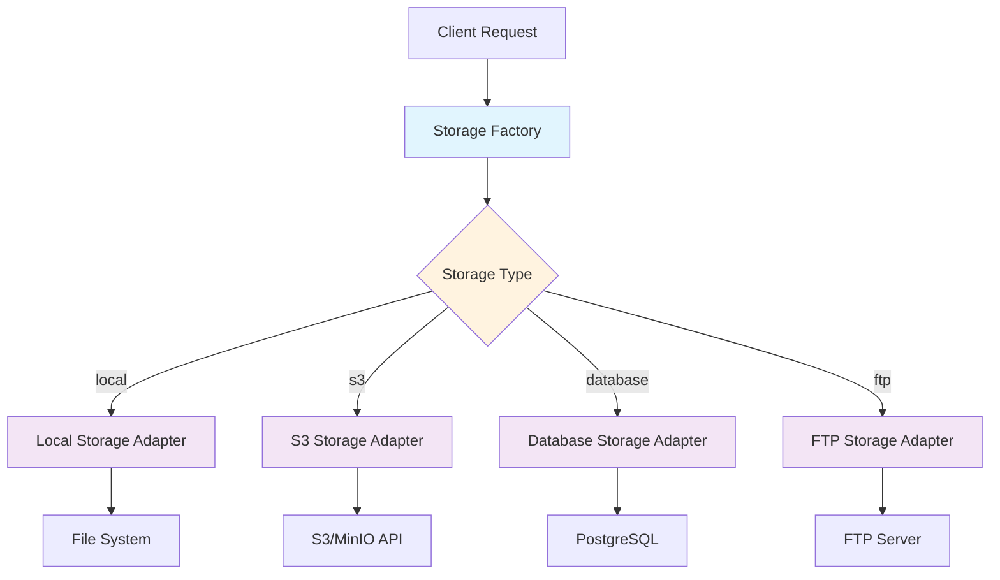

# 🚀 PolyDrive - Multi-Backend Storage Service

A professional, production-ready storage service built with NestJS that provides a unified API for storing and retrieving blobs across multiple storage backends.

## ✨ Features

- ** WT Authentication** - Secure API endpoints with Bearer token authentication
- **Multiple Storage Backends** - Local Filesystem, Amazon S3 Compatible Storage, Database, and FTP
- **RESTful API** - Clean and intuitive API design following REST principles
- **Swagger Documentation** - Interactive API documentation with ready-to-use examples
- **Docker Ready** - Containerized for easy deployment and development
- **Testing** - Comprehensive unit tests and integration testing

## 🏗️ Architecture

The service follows SOLID principles and implements several design patterns:

- **Factory Pattern** - `StorageFactory` for dynamic storage backend selection
- **Strategy Pattern** - Storage adapters for different backends
- **Repository Pattern** - Data access layer abstraction
- **Dependency Injection** - NestJS IoC container for loose coupling

### Storage Factory Pattern

The Storage Factory pattern allows the application to dynamically select and instantiate the appropriate storage backend based on configuration:


```

## 🚀 Quick Start

### Using Docker

1. **Clone and navigate to the project:**
   ```bash
   cd PolyDrive
   ```

2. **Start all services:**
   ```bash
   docker-compose up -d
   ```

3. **Access the API:**
   - **Main API**: http://localhost:3000
   - **Swagger Documentation**: http://localhost:3000/api
   - **Health Check**: http://localhost:3000/health

### Manual Installation

1. **Install dependencies:**
   ```bash
   npm install
   ```

2. **Set up environment variables:**
   ```bash
   cp .env.example .env
   # Edit .env with your configuration
   ```

3. **Start the service:**
   ```bash
   npm run start:dev
   ```

## 📚 API Documentation

### Swagger UI
The most comprehensive way to explore and test the API is through our interactive Swagger documentation:

**🌐 Open Swagger UI**: http://localhost:3000/api

The Swagger UI provides:
- **Interactive API Explorer** - Test endpoints directly from the browser
- **Request/Response Examples** - Ready-to-use examples for all operations
- **Authentication Setup** - Easy JWT token configuration
- **Schema Documentation** - Complete data model documentation
- **Try It Out** - Execute API calls with real-time feedback


   ```

## 💾 Storage Backends

### Local Filesystem (Default)
- **Configuration**: `STORAGE_TYPE=local`
- **Path**: `LOCAL_STORAGE_PATH=./storage`
- **Use Case**: Development, testing, single-server deployments

### Amazon S3 Compatible
- **Configuration**: `STORAGE_TYPE=s3`
- **Supports**: AWS S3, MinIO, DigitalOcean Spaces, etc.
- **Features**: Custom HTTP implementation (no SDK required)

#### MinIO Access (Docker Setup)
When using the Docker Compose setup, MinIO is available at:
- **S3 API Endpoint**: http://localhost:9000
- **Web Console**: http://localhost:9001
- **Access Key**: `minioadmin`
- **Secret Key**: `minioadmin`
- **Default Bucket**: `polydrive`

**Note**: The MinIO console allows you to browse buckets, upload/download files, and manage your S3-compatible storage through a web interface.

### Database Storage
- **Configuration**: `STORAGE_TYPE=database`
- **Use Case**: Small blobs, transactional consistency

### FTP Server
- **Configuration**: `STORAGE_TYPE=ftp`
- **Use Case**: Legacy systems, compliance requirements

## 🧪 Testing

### Storage Backend Testing
We provide comprehensive scripts to test all storage backends:

#### Quick Storage Demo


#### Comprehensive Storage Testing
Test all storage backends by switching between them:
```bash
./test-all-storages.sh
```

#### Unit Tests
```bash
npm test
```

#### Integration Tests
```bash
npm run test:e2e
```

```bash
================================
PolyDrive Storage Backend Testing
================================
This script will test all available storage backends
and demonstrate the multi-storage capabilities of PolyDrive.

[INFO] Starting with local storage backend...
[INFO] Waiting for service to be ready...
[SUCCESS] Service is ready!
[INFO] Getting JWT authentication token...
[SUCCESS] JWT token obtained successfully
Token: eyJhbGciOiJIUzI1NiIs...
================================
Current Storage Configuration
================================
[INFO] Current STORAGE_TYPE: s3
[INFO] S3 endpoint: http://minio:9000
[INFO] S3 bucket: polydrive

================================
Testing local Storage Backend
================================
[INFO] Storing test blob in local storage...
[SUCCESS] Blob stored successfully in local storage
Response: {"id":"test-storage-demo-local","data":"SGVsbG8gZnJvbSBQb2x5RHJpdmUhIFRlc3RpbmcgYWxsIHN0b3JhZ2UgYmFja2VuZHMg8J+agA==","size":"55","created_at":"2025-08-13T21:25:22.355Z"}
[INFO] Retrieving blob from local storage...
[SUCCESS] Blob retrieved successfully from local storage
Retrieved data: Hello from PolyDrive! Testing all storage backends 🚀
[SUCCESS] Data integrity verified - stored and retrieved data match!
[INFO] Checking if blob exists in local storage...
[SUCCESS] Blob exists in local storage

================================
Switching to s3 Storage
================================
[INFO] Stopping current containers...
[INFO] Updating storage configuration to s3...
[INFO] Starting containers with s3 storage...
[INFO] Waiting for service to be ready...
[SUCCESS] Service is ready!
[INFO] Getting JWT authentication token...
[SUCCESS] JWT token obtained successfully
Token: eyJhbGciOiJIUzI1NiIs...
================================
Current Storage Configuration
================================
[INFO] Current STORAGE_TYPE: s3
[INFO] S3 endpoint: http://minio:9000
[INFO] S3 bucket: polydrive

================================
Testing s3 Storage Backend
================================
[INFO] Storing test blob in s3 storage...
[SUCCESS] Blob stored successfully in s3 storage
Response: {"id":"test-storage-demo-s3","data":"SGVsbG8gZnJvbSBQb2x5RHJpdmUhIFRlc3RpbmcgYWxsIHN0b3JhZ2UgYmFja2VuZHMg8J+agA==","size":"55","created_at":"2025-08-13T21:25:56.633Z"}
[INFO] Retrieving blob from s3 storage...
[SUCCESS] Blob retrieved successfully from s3 storage
Retrieved data: Hello from PolyDrive! Testing all storage backends 🚀
[SUCCESS] Data integrity verified - stored and retrieved data match!
[INFO] Checking if blob exists in s3 storage...
[SUCCESS] Blob exists in s3 storage

================================
Switching to database Storage
================================
[INFO] Stopping current containers...
[INFO] Updating storage configuration to database...
[INFO] Starting containers with database storage...
[INFO] Waiting for service to be ready...
[SUCCESS] Service is ready!
[INFO] Getting JWT authentication token...
[SUCCESS] JWT token obtained successfully
Token: eyJhbGciOiJIUzI1NiIs...
================================
Current Storage Configuration
================================
[INFO] Current STORAGE_TYPE: database
[INFO] Using database storage (PostgreSQL)

================================
Testing database Storage Backend
================================
[INFO] Storing test blob in database storage...
[SUCCESS] Blob stored successfully in database storage
Response: {"id":"test-storage-demo-database","data":"SGVsbG8gZnJvbSBQb2x5RHJpdmUhIFRlc3RpbmcgYWxsIHN0b3JhZ2UgYmFja2VuZHMg8J+agA==","size":"55","created_at":"2025-08-13T21:26:30.486Z"}
[INFO] Retrieving blob from database storage...
[SUCCESS] Blob retrieved successfully from database storage
Retrieved data: Hello from PolyDrive! Testing all storage backends 🚀
[SUCCESS] Data integrity verified - stored and retrieved data match!
[INFO] Checking if blob exists in database storage...
[SUCCESS] Blob exists in database storage
```

### Docker Compose

The project includes a complete Docker Compose setup with:
- **PostgreSQL** - Database for metadata and optional blob storage
- **MinIO** - S3-compatible storage for testing
- **FTP Server** - Pure-FTPd for FTP storage testing
- **PolyDrive App** - The main application
